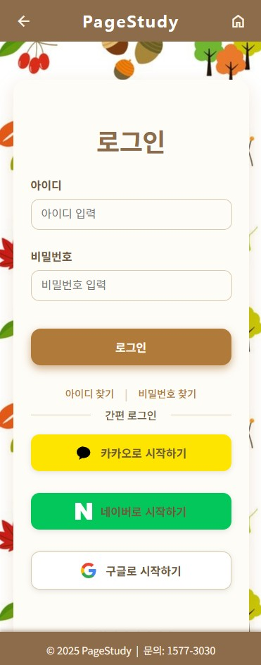

# 📚 감성스터디 카페 (PageStudy)

> **“사용자를 위한, 사용자에 의한, 사용자의 예약 시스템”**

  

---

## 1. 📌 프로젝트 주제  
**React를 활용한 감성 라이더 전용 SNS 만들기**

---

## 2. 💡 프로젝트 소개  
**무복노트(MUBOKNOTE)**는 이륜차 라이더들이 드라이브 코스를 공유하고 기록할 수 있는 감성 SNS입니다.  
영상이 아닌 지도 기반으로 경로를 시각화하고, 경유지, 계절, 풍경 정보를 공유합니다.  
기존 유튜브 중심의 정보 제공 방식에서 벗어나, 라이더 관점에서 필요한 정보를 중심으로 구성했습니다.

---

## 3. 🎯 기획 배경

| ❓ 불편했던 점 | ✅ 무복노트의 해결 방식 |
|----------------|--------------------------|
| 이륜차 전용 여행 정보 부족 | 경로, 도로 정보 중심의 코스 공유 |
| 도로 특성 파악 어려움 | 포장 상태, 곡선/직선 여부 등 태그화 |
| 비사교적 라이더의 정보 접근 장벽 | 개방형 SNS 구조 + 검색/필터 제공 |
| 영상 중심 정보의 비효율성 | 지도 기반 시각화 및 경유지 중심 설명 |

---

## 4. ⏱️ 개발 기간  
**2025.05.07 ~ 2025.05.15 (1주간)**
2025.05.19 ~ 2025.06.07 (유지보수기간)

---

## 5. 🛠 사용 기술

| 분류 | 기술 |
|------|------|
| Frontend | React, MUI |
| Backend | Node.js, Express |
| Database | MySQL |
| 기타 | KakaoMap API, JWT, Bcrypt |

---

## 6. 📄 페이지별 주요 기능

### 🚩 1. 피드 / 코스 등록  
- 출발지 / 경유지 / 도착지 입력 시 **경로(polyline) 자동 생성** (KakaoMap API 연동)  
- 사진 미리보기, 삭제 기능 포함한 이미지 다중 업로드 기능
- 설명, 계절, 난이도, 태그, 장소 유형, 바이크 cc 등 다양한 정보 입력 가능

  

  

---

### 🖼️ 2. 피드 리스트 & 상세 보기  
- 이미지 슬라이더 + 지도 기반 polyline 표시
- 좋아요 / 댓글 / 북마크 기능
- 내가 작성한 피드 수정 및 삭제  
- 피드 수정 시 기존 코스 자동 불러오기
- 상세보기 UI는 공통 컴포넌트(FeedHeader, FeedActionButtons)로 분리 구성

  

  

  

---

### 🔍 3. 검색 및 필터  
- 지역, 계절, 바리 종류, 장소 유형, 바이크 cc, 키워드 기반 필터
- HeaderFilter 컴포넌트로 구현, 조건 변경 시 자동 검색 수행
- 검색어 초기화 및 리셋 기능 포함 

---

### 💬 4. 댓글 기능
- 댓글 등록, 수정, 삭제 가능
- 댓글 작성자는 인라인 수정 가능하며, 본인만 삭제/수정 버튼 노출
- 리스트 실시간 반영 처리

---

### 🤍 5. 좋아요 기능
- 피드 리스트 및 상세 페이지에서 좋아요 버튼 클릭 시 색상 변경
- 좋아요 상태 DB 저장 (feed_like 테이블 연동)

---

### 📌 6. 북마크 기능
- 피드 리스트 및 상세 페이지에서 북마크 버튼 표시
- 프로필 페이지에서 내 북마크 목록 조회 가능

---

### 👤 7. 프로필 페이지 
- 내가 작성한 피드 리스트 출력
- 내가 북마크한 피드 리스트 구분 표시
- 친구 목록 및 언팔로우 기능 구현
- 상단 정보는 로그인된 유저 정보 연동 처리 

---

### 💬 8. 채팅 기능  
- 1:1 채팅방 생성 UI 구현  
- 채팅 목록 및 입력창 컴포넌트 구성  
- 채팅 메시지 저장 및 조회를 위한 DB 구조 설계 및 연동

---

### 🔔 9. 알림 기능
- 댓글, 좋아요 등의 활동 발생 시 알림 DB 저장  
- 사용자별 알림 목록 조회 기능 및 Drawer UI 구성
---

### 🏁 10. 메인 페이지  
- 최신 피드 리스트, 검색 필터, 좌측 고정 메뉴를 배치

  

---

### 🔐 11. 로그인 / 회원가입  

  
  

---

## 7. ✨ 프로젝트 후기

### 👍 좋았던 점
- 이전 팀 프로젝트에서 사용하지 못했던 KakaoMap API를 집중적으로 다룰 수 있었음  
- 개인 취미와 밀접한 주제로, 직접 필요한 기능을 기획하고 반영할 수 있었음  
- Vue.js와 다른 React의 컴포넌트 중심 개발 방식을 직접 체험하고 비교할 수 있었음  

### 😢 아쉬웠던 점
- 채팅과 알림 기능을 실시간으로 연동하고 싶었지만, 일주일이라는 짧은 개발 기간 내에는 UI 구성과 데이터 저장까지만 진행함
- 이후 유지보수를 통해 완성도를 높이려 했지만, 정규 수업과 병행하는 일정 속에서 하루 2~3시간만 투입 가능해 아쉬움이 남았음

---
