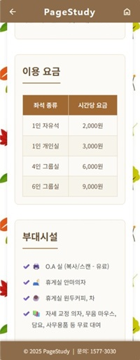
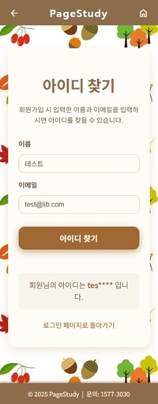
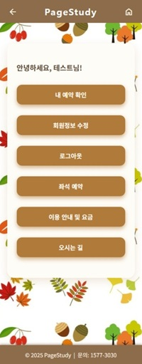

# 📚 PageStudy - 스터디 카페 좌석 예약 시스템

> **"사용자를 위한, 사용자에 의한, 사용자의 예약 시스템"**

모바일 전용 화면으로 구현된 스터디카페 좌석 예약 시스템입니다.  
사용자 편의성을 최우선으로 고려하여 직관적이고 간편한 예약 경험을 제공합니다.


<p align="center">
  
  
  
</p>

---

## 💡 프로젝트 소개

**PageStudy**는 스터디카페의 좌석 예약 기능을 모바일 전용 화면으로 구현한 웹 애플리케이션입니다.

### 핵심 컨셉

- **모바일 최적화**: 모바일 전용 화면으로 직관적이고 단순한 사용자 경험
- **사용자 편의성**: 클릭만으로 간편하게 예약할 수 있는 인터페이스
- **안전한 인증**: JWT 토큰 기반 인증 및 소셜 로그인 지원
- **실시간 예약 관리**: 좌석 상태 실시간 확인 및 1인 1예약 원칙 적용

---

## 🎯 프로젝트 특징

### 기술적 특징

| 특징                      | 설명                                                         |
| ------------------------- | ------------------------------------------------------------ |
| **모바일 전용 아키텍처**  | Vue.js와 jQuery를 활용한 모바일 최적화 인터페이스            |
| **JWT + argon2 보안**     | 토큰 기반 인증과 강력한 비밀번호 해싱으로 안전한 사용자 인증 |
| **OAuth 2.0 소셜 로그인** | 카카오, 네이버, 구글 소셜 로그인 지원                        |
| **Oracle Database**       | 안정적인 관계형 데이터베이스로 예약 데이터 관리              |
| **서버 사이드 검증**      | 이메일/전화번호 형식 검증 및 SQL 인젝션 방지                 |

### 사용자 경험 특징

- **직관적인 인터페이스**: 터치 환경을 고려한 큰 버튼과 선택 영역
- **실시간 피드백**: 입력 검증 및 에러 메시지 즉시 표시
- **편리한 예약 프로세스**: 날짜 → 시간 → 좌석 선택의 단순한 흐름
- **명확한 상태 표시**: 예약 가능/불가 좌석을 색상으로 구분

---

## ⏱️ 개발 기간

**2025.09.12 ~ 2025.09.19 (8일)**

---

## 🛠 사용 기술

### Frontend

| 기술명                                                                            | 설명                               |
| --------------------------------------------------------------------------------- | ---------------------------------- |
|  | Vue.js 3.x - 프론트엔드 프레임워크 |
|  | jQuery 3.7.1 - AJAX 통신 및 DOM 조작     |
|          | CSS - 모바일 전용 반응형 디자인    |

### Backend

| 기술명                                                                               | 설명                                           |
| ------------------------------------------------------------------------------------ | ---------------------------------------------- |
|  | Node.js - 비동기 이벤트 기반 서버 런타임       |
|  | Express 5.1.0 - 간결한 웹 프레임워크                 |
|     | Oracle Database (oracledb 6.9.0) - 관계형 데이터베이스          |
|    | JWT - 토큰 기반 인증                           |
|     | argon2 - 비밀번호 해싱                         |
|   | OAuth 2.0 - 소셜 로그인 (카카오, 네이버, 구글) |

### 개발 도구

| 기술명                                                                               | 설명                 |
| ------------------------------------------------------------------------------------ | -------------------- |
|  | Swagger - API 문서화 |
|              | Git - 버전 관리      |

---

## 📄 주요 기능

### 🔐 사용자 인증 및 계정 관리

- **일반 로그인/회원가입**: 아이디, 비밀번호 기반 인증
- **소셜 로그인**: 카카오, 네이버, 구글 로그인 지원
- **계정 복구**: 아이디 찾기, 비밀번호 재설정 (임시 비밀번호 발급)
- **계정 관리**: 사용자 정보 수정, 비밀번호 변경, 회원 탈퇴

<details>
<summary>📸 스크린샷 보기</summary>

#### 로그인 & 회원가입

<p align="center">
  &nbsp;&nbsp;&nbsp;&nbsp;
  
</p>

#### 아이디 찾기 & 비밀번호 찾기

<p align="center">
  &nbsp;&nbsp;&nbsp;&nbsp;
  
</p>

#### 내 정보 수정 & 회원 탈퇴

<p align="center">
  &nbsp;&nbsp;&nbsp;&nbsp;
  
</p>

</details>

### 🪑 좌석 예약 시스템

- **좌석 조회**: 좌석 유형별 조회 및 날짜/시간대별 예약 가능 좌석 확인
- **예약 프로세스**: 날짜 선택 → 시간 선택 → 좌석 선택 → 예약 확인
- **실시간 상태 표시**: 예약 가능/불가 좌석을 색상으로 구분
- **1인 1예약 원칙**: 활성 예약이 있는 사용자는 추가 예약 불가

<details>
<summary>📸 스크린샷 보기</summary>

#### 좌석 예약 페이지

<p align="center">
  &nbsp;&nbsp;&nbsp;&nbsp;
  &nbsp;&nbsp;&nbsp;&nbsp;
  
</p>

</details>

### 📅 예약 관리

- **예약 내역 조회**: 전체 예약 내역 및 상태별 필터링 (확정/취소)
- **예약 취소**: 종료 전까지 예약 취소 가능
- **활성 예약 확인**: 현재 활성화된 예약 자동 확인

<details>
<summary>📸 스크린샷 보기</summary>

#### 예약 내역 & 예약 정보 확인

<p align="center">
  &nbsp;&nbsp;&nbsp;&nbsp;
  
</p>

</details>

### 🎨 모바일 최적화 UI/UX

- **터치 친화적 디자인**: 큰 버튼과 선택 영역으로 터치 환경 최적화
- **직관적인 네비게이션**: Header/Footer 고정 및 뒤로가기/홈 버튼 항시 표시
- **실시간 피드백**: 입력 검증 및 에러 메시지 즉시 표시
- **일관된 디자인**: 페이지별 통일된 디자인 시스템

<details>
<summary>📸 스크린샷 보기</summary>

#### 메인 화면 & 공통 UI

<p align="center">
  &nbsp;&nbsp;&nbsp;&nbsp;
  
</p>

</details>

---

## 🎨 UI/UX 특징

### 모바일 전용 디자인

- **직관적인 메뉴 구조**: 복잡한 네비게이션 없이 단순한 흐름
- **터치 최적화**: 큰 버튼과 선택 영역으로 터치 환경 고려
- **일관된 디자인**: 페이지별 통일된 Header/Footer 및 스타일

### 사용자 편의 기능

- **입력 영역 강조**: 포커스 시 시각적 피드백
- **실시간 검증**: 입력 즉시 형식 검증 및 에러 표시
- **명확한 상태 표시**: 예약 가능/불가 좌석 색상 구분
- **예약 정보 요약**: 선택한 예약 정보를 한눈에 확인

---

## 🚀 시작하기

### 필수 요구사항

- Node.js (v14 이상)
- Oracle Database (11g 이상)
- Oracle Instant Client

### 설치 및 실행

```bash
# 저장소 클론
git clone https://github.com/your-username/PageStudy.git
cd PageStudy

# 의존성 설치
npm install

# 환경 변수 설정
# .env 파일 생성 및 설정 (아래 참고)

# 데이터베이스 설정
# Oracle Database 연결 정보 설정
# 마이그레이션 스크립트 실행 (필요 시)

# 서버 실행
npm start
```

### 환경 변수 설정

**server/.env**

```env
# 서버 설정
PORT=3009
NODE_ENV=development

# 데이터베이스 설정
DB_USER=your_username
DB_PASSWORD=your_password
DB_CONNECTION_STRING=localhost:1521/XE

# JWT 설정
JWT_SECRET=your_jwt_secret_key
JWT_EXPIRES_IN=7d

# 소셜 로그인 설정
KAKAO_CLIENT_ID=your_kakao_client_id
KAKAO_CLIENT_SECRET=your_kakao_client_secret
KAKAO_REDIRECT_URI=http://localhost:3009/auth/kakao/callback

NAVER_CLIENT_ID=your_naver_client_id
NAVER_CLIENT_SECRET=your_naver_client_secret
NAVER_REDIRECT_URI=http://localhost:3009/auth/naver/callback

GOOGLE_CLIENT_ID=your_google_client_id
GOOGLE_CLIENT_SECRET=your_google_client_secret
GOOGLE_REDIRECT_URI=http://localhost:3009/auth/google/callback
```

---

## 📁 프로젝트 구조

```
PageStudy/
├── client/              # Frontend 클라이언트
│   ├── *.html          # HTML 페이지
│   ├── js/             # JavaScript 파일
│   │   ├── config.js   # API 설정
│   │   ├── auth.js     # 인증 유틸리티
│   │   └── common.js   # 공통 함수
│   └── css/            # CSS 파일
├── server/             # Backend 서버
│   ├── server.js       # 서버 진입점
│   ├── db.js           # 데이터베이스 연결
│   ├── config.js       # 설정 파일
│   ├── routes/         # 라우터
│   │   └── auth.js     # 소셜 로그인 라우터
│   ├── middleware/     # 미들웨어
│   │   └── auth.js     # 인증 미들웨어
│   ├── utils/          # 유틸리티
│   │   ├── passwordHash.js    # 비밀번호 해싱
│   │   ├── validators.js      # 입력 검증
│   │   ├── dbHelper.js        # DB 헬퍼
│   │   └── errorResponse.js   # 에러 응답
│   └── migration/      # DB 마이그레이션
└── docs/               # 문서
    ├── API.md          # API 문서
    ├── DAY*.md         # 개발일지
    └── 포트폴리오_요약본.md
```

---

## ✨ 주요 기능 요약

| 기능          | 기술적 특징                                  |
| ------------- | -------------------------------------------- |
| 사용자 인증   | JWT 토큰, argon2 해싱, OAuth 2.0 소셜 로그인 |
| 좌석 예약     | 실시간 좌석 상태 조회, 1인 1예약 원칙        |
| 예약 관리     | 예약 내역 조회, 예약 취소, 활성 예약 확인    |
| 보안 기능     | 서버 사이드 검증, SQL 인젝션 방지            |
| 모바일 최적화 | 터치 친화적 UI, 직관적인 네비게이션          |

---

## 📚 상세 문서

- [API 문서](./docs/API.md) - API 엔드포인트 상세 설명
- [개발일지](./docs/DAY1_개발일지.md) - 일자별 개발 과정
- [포트폴리오 요약본](./docs/포트폴리오_요약본.md) - 프로젝트 핵심 요약

---

## 🎯 프로젝트 성과

- ✅ 목표한 핵심 기능 100% 구현
- ✅ 사용자 인증 시스템 완성 (일반 로그인, 소셜 로그인)
- ✅ 좌석 예약 시스템 완성
- ✅ 보안 기능 구현 (JWT, 비밀번호 해싱)
- ✅ API 문서화 완료 (Swagger)
- ✅ 상세한 코드 주석 추가

---

## 💡 배운 점

- **OAuth 2.0 인증 플로우**: 카카오, 네이버, 구글 소셜 로그인 구현 및 OAuth 2.0 표준 이해
- **JWT 토큰 관리**: 토큰 기반 세션 관리 및 인증 미들웨어 구현
- **비밀번호 해싱**: argon2 알고리즘을 통한 보안 강화 및 마이그레이션 경험
- **데이터베이스 설계**: Oracle Database를 활용한 테이블 설계 및 JOIN 쿼리 최적화
- **프로젝트 관리**: 단계별 개발 계획 수립 및 문서화의 중요성

---

## 📝 라이선스

이 프로젝트는 개인 프로젝트입니다.

---

**개발 기간**: 2025년 9월 12일 ~ 9월 19일  
**버전**: 1.0.0
