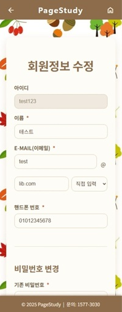
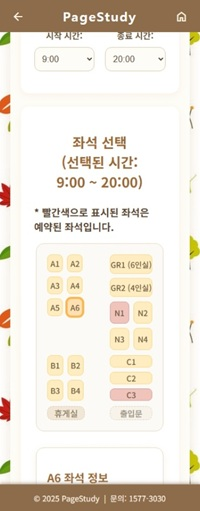
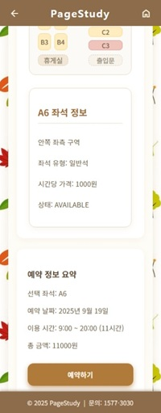
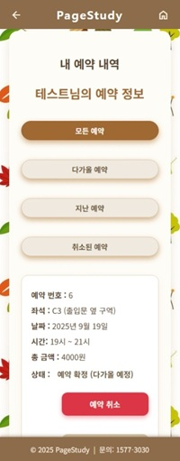

# 📚 스터디 카페 (PageStudy) 좌석 예약 시스템

> **“사용자를 위한, 사용자에 의한, 사용자의 예약 시스템”**

  
  
  
  

---

## 1. 프로젝트 주제  

📝 **Vue + Express를 활용한 스터디카페 좌석 예약 시스템 구현하기**

---

## 2. 프로젝트 소개  

📝 **PageStudy**는 스터디카페로, 좌석 예약 기능을 수행합니다. 

📝 **모바일 전용 화면**으로 제한하여 모바일 전용 화면의 한계를 체험하고자 합니다.  

📝 **사용자 편의성**에 중점을 두어 사용자가 최대한 쉽게 클릭만으로 예약할 수 있도록 구현했습니다.

---

## 3. 기획 배경

📝 사용자 편의성을 고려할 때, 사용자를 위해 어떤 편의 기능까지 제공할 수 있는가?

📝 현재 본인의 코딩 능력으로 사용자 편의 기능을 어디까지 구현할 수 있는가?

📝 모바일 전용 화면으로 구현할 때의 장점과 단점은 무엇인가?

---

## 4. 개발 기간  
📝 **2025.09.12 ~ 2025.09.19**

---

## 5. 사용 기술
| 분류 | 기술 |
|------|------|
| Frontend | Vue.js |
| Backend | Node.js, Express |
| Database | Oracle SQL |
---

## 6. 페이지별 주요 기능

### 📝 1. 공통
#### 📌모바일 전용 화면 환경에 따라 직관적으로 메뉴 보여주기
#### 📌터치 환경을 고려하여 선택 영역, 버튼, 입력 영역 화면 내 최대화
#### 📌페이지별 통일성 - 디자인 통일, Header(헤더) 및 Footer(푸터) 고정
#### 📌Header 영역 뒤로가기와 홈버튼(메인으로) 항시 상단 고정하여 편의성 고려

---

### 📝 2. 로그인 / 회원가입
#### 📌입력 영역 강조 효과
#### 📌정보 입력 시 사용자 편의성 고려하여 작성 안내
#### 📌사용자의 입력 및 선택 오류에 따른 에러 안내를 인라인 메세지로 구현
#### 📌이메일 입력 시 도메인 선택을 통한 사용자 편의성 제공

  
  

---

### 📝 3. 아이디 찾기 / 비밀번호 찾기 / 내 정보 수정 / 회원 탈퇴
#### 📌아이디 찾기 : 아이디 뒷부분 *표 처리 / 추후 확장 시 메일 발송 통한 전체 아이디 안내
#### 📌비밀번호 찾기 : 임시 비밀번호 발급(랜덤 문자열) / 추후 확장 시 메일 발송 통한 본인 인증 및 변경 유도
#### 📌내 정보 수정 : 아이디 disabled 처리 (수정 불가) / 입력 영역 강조 효과 / 에러 안내 인라인 메세지
#### 📌비밀번호 변경 : 기존 비밀번호 입력 시 수정 가능 (내 정보 수정 포함) 
#### 📌회원 탈퇴 : 회원 탈퇴

  
  
  
  

---

### 📝 4. 좌석 예약
#### 📌예약 날짜 선택 : 달력 제공 
#### 📌이용 시간 선택1 : 시작 시간 / 당일 예약 시 현재 시간 반영하여 현재 시간 이후 시간부터 예약 가능 
(ex. 14시 25분에 예약 진행 시 15시부터 선택 가능)
#### 📌이용 시간 선택2 : 종료 시간 / 영업 시간 반영하여 선택 가능 시간 보여주기 
(22시까지 영업이므로 20시 30분에 예약 진행시 21시~22시 시간으로 예약 가능)
#### 📌이용 시간 선택3 : 추후 확장 시 분 단위 선택 가능하도록 구현 예정
#### 📌좌석 선택1 : 날짜와 시간 선택 시에 등장, 1인석 및 그룹실 제공
(기존 다른 이용자의 예약과 1시간이라도 겹친다면 좌석 선택 불가(빨간색 표시)
#### 📌좌석 선택2 : 좌석 구조 실제 위치 반영하여 안내, 기예약 좌석 예약 불가 표시 및 선택 불가 처리리
(추후 확장 사항으로 기예약 좌석 클릭 시 해당 좌석 예약된 시간 보여주어 사용자가 확인하여 예약 가능하도록 구현 예정)
#### 📌좌석 선택3 : 선택한 좌석 정보 상세 안내 및 예약 정보 요약
#### 📌추후 확장 사항으로 결제 API 연동하여 결제 완료 시에 예약 확정

  
  
  

---

### 📝 5. 1인 1예약 / 예약 정보 확인
#### 📌1인 1예약 : 이미 예약 건이 있는 사용자는 추가 예약이 불가하도록 안내 및 선택 불가 처리
#### 📌예약 정보 확인1 : 모든 예약 확인 및 이미 사용되었거나 취소한 내역도 따로 보기 가능
#### 📌예약 정보 확인2 : 정보 확인과 동시에 취소도 가능
#### 📌예약 정보 확인3 : 추후 확장 시 예약 변경 기능 추가 예정

  
  

---

## 7. ✨ 프로젝트 후기

### 👍 좋았던 점
- 사용자만을 생각하며 기능들을 구현하다보니 더 많은 기능과 표현을 알 수 있었음  
- 모바일 전용 화면의 장점인 직관적이고 단순한 페이지 흐름이 백엔드 작업에 집중하기 좋았음

### 😢 아쉬웠던 점
- 단일 지점이고 지점의 크기나 좌석 수, 회원 수가 많지 않았기에 데이터 다루는 부분을 깊게 활용하지 못함
- 너무 사용자만을 의식해서 구현하다보니 관리자 입장에서의 기능 구현을 못함

---
