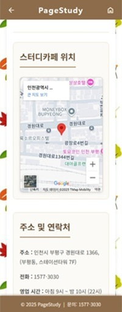

# 📚 감성스터디 카페 (PageStudy)

> **“사용자를 위한, 사용자에 의한, 사용자의 예약 시스템”**

  
  
  
  

---

## 1. 프로젝트 주제  

📝 **Vue + Express를 활용한 스터디카페 좌석 예약 시스템 구현하기**

---

## 2. 프로젝트 소개  

📝 **PageStudy**는 스터디카페로, 좌석 예약 기능을 수행합니다. 

📝 모바일 전용 화면으로 제한하여 모바일 전용 화면의 한계를 체험하고자 합니다.  

📝 사용자 편의성에 중점을 두어 사용자가 최대한 쉽게 예약할 수 있도록 구현했습니다.

---

## 3. 기획 배경

📝 많은 사이트들이 사용자 편의성을 고려하여 기능을 제공하지만 과연 어디까지 제공할 수 있는가?

📝 현재 본인의 컴퓨터 언어 지식 수준으로 사용자 편의 기능을 어디까지 구현할 수 있겠는가?

📝 모바일 전용 화면으로 구현할 때의 장점과 단점은 무엇인가?

---

## 4. 개발 기간  
📝 **2025.09.12 ~ 2025.09.19**

---

## 5. 사용 기술

---

## 6. 페이지별 주요 기능

### 📝 1. 공통
#### 📌모바일 전용 화면 환경에 따라 직관적으로 메뉴 보여주기
#### 📌터치 환경을 고려하여 선택 영역, 버튼, 입력 영역 화면 내 최대화
#### 📌페이지별 통일성 - 디자인 통일, Header(헤더) 및 Footer(푸터) 고정
#### 📌Header 영역 뒤로가기와 홈버튼(메인으로) 항시 상단 고정하여 편의성 고려
---
### 📝 2. 로그인 / 회원가입
#### 📌입력 영역 강조 효과
#### 📌사용자 에러에 따른 에러 안내를 인라인 메세지로 구현

  
  

---

